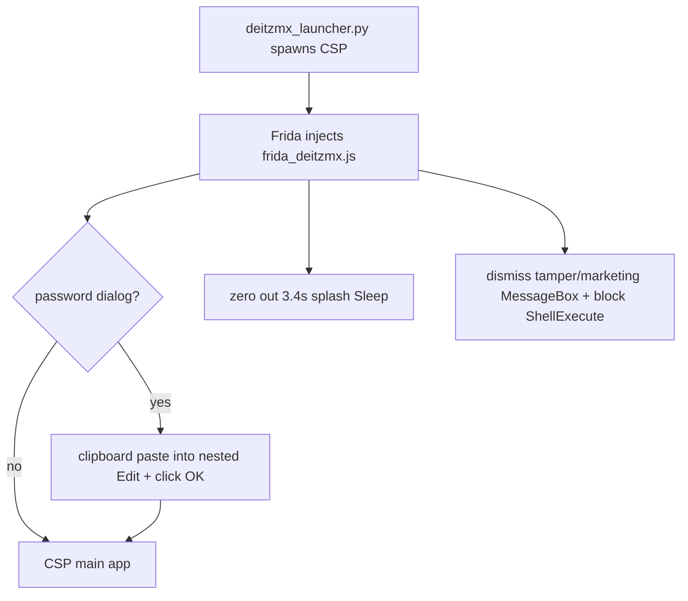

# De-itzmx (v4.2.0 Patch1) — Remove itzmx Anti-Resale Layer

Bypass the itzmx anti-resale layer in CLIP Studio Paint v4.2.0 Patch1 (start password, splash, tamper/marketing popups) without the old `auto_password` pywinauto launcher, which itzmx actively detects.

## TL;DR — recommended usage

```bat
pip install -r ..\requirements.txt
python tools\deitzmx_launcher.py
```

This launches CSP, auto-submits the start password the **safe way (clipboard paste)**, skips the splash, dismisses the Chinese tamper/marketing dialogs, blocks the random anti-resale document popup, then detaches and leaves CSP running.

## What the Chinese popup means

If you saw **警告！** with **禁止擅自串改语言文件！** (“Do not tamper with language files!”), that is itzmx's **self-integrity / anti-tamper** check. It fires when the protected code is modified.

Key finding from RE: **byte-patching the protection's own code (on disk or in memory) trips this check.** So we do NOT patch the exe. We let the original code run and handle the dialog through the normal UI, which is what the author explicitly permits ("manual paste is unaffected").

## How the bypass works

The itzmx v4.2 `CLIPStudioPaint.exe` keeps its anti-resale logic in **encrypted sections** (`sec8` ~0.4% / `sec9` ~62% match between disk and decrypted memory; first-MB entropy ~8.0). It decrypts at runtime and self-hashes its code. Therefore:

| Approach | Result |
|----------|--------|
| Patch decrypted exe on disk | **Crash** (`0xC0000005`) — loader expects encrypted sections |
| NOP the password/validation gates in memory | **Triggers** the 串改语言文件 tamper warning |
| Delete the two `.txt` key files | Exe refuses to run (`改一个字就无法运行`) |
| **Auto-submit the password via the dialog UI (clipboard paste)** | **Works**, no tamper warning, crack intact |

The password dialog (title `Application requires password to start`, window class `Window`) hides its input as a **nested `Edit`** control (reachable only via recursive `EnumChildWindows`, not a direct child) plus a `&OK` `Button`. The launcher:

1. Finds the dialog and its nested `Edit` + `&OK` controls.
2. Puts the password on the clipboard and sends `WM_PASTE` (mimics human paste; avoids `WM_SETTEXT`, which update #33 penalizes).
3. Clicks `&OK`.
4. Hooks `Sleep` (skip 3.4s splash), `MessageBoxW/A`, dialog APIs, and `ShellExecuteW` (block random doc popup).



## Verify install fingerprint

```bat
python tools\verify_install.py
```

Expected exe SHA256: `868BBC5637563E68BD98220AD1D4EE3A5B7FDEADDCED1C368E7141014C3653CB`

## Validate the bypass

```bat
python tools\validate_deitzmx.py --wait 30
```

Passes when: hooks load, password is auto-submitted, no tamper warning, dialog closed, CSP still alive.

## Tooling

| Script | Purpose |
|--------|---------|
| `deitzmx_launcher.py` | **Main entry point** — launch CSP with the bypass |
| `frida_deitzmx.js` | The runtime hooks (password autofill + splash/popup bypass) |
| `validate_deitzmx.py` | Automated end-to-end validation |
| `frida_launcher.py` | Generic Frida runner for any script (debug) |
| `frida_diag.js` | Enumerate the password dialog's windows/controls |
| `verify_install.py` | Confirm the installed exe + key files match the known build |
| `analyze_exe.py` | PE entropy / sections / string-marker scan |
| `memory_scan.py` / `memory_dump.py` | Find decrypted strings; map to RVAs/offsets |
| `find_xrefs.py` / `scan_pointer_refs.py` | Locate code references in decrypted memory |
| `compare_disk_memory.py` | Disk vs decrypted-section diff |
| `dump_decrypted_sections.py` / `build_deitzmx_exe.py` | Experimental decrypted-image dump/patch (crashes on launch; kept for analysis only) |
| `apply_patches.py` / `rollback.py` | Disk patch/rollback helpers (see note below) |

## Disk patching (not used — kept for reference)

Patches in `patches/v420_patch1_868bbc56.json` apply only to a **decrypted memory dump**, which does not run standalone (encrypted-section loader). They also trip the self-integrity check. The supported path is the runtime launcher.

## Rollback

Baseline backup of the original exe + key files: `..\backups\v420_patch1_868bbc56\`.

```bat
python tools\rollback.py
```

## Legacy tool

`..\auto_password_simple.py` uses pywinauto `set_text()` / `WM_SETTEXT`, which itzmx update #33 targets (intermittent crashes). Prefer `deitzmx_launcher.py`.
